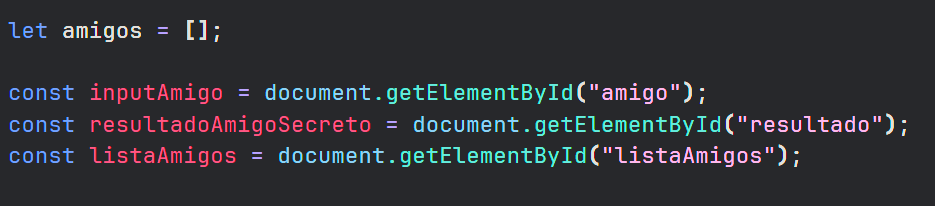

# challenge-amigo-secreto_esp-main

En este proyecto se ponen a prueba algunas de las funcionalidades basicas de Javascript mediante html.
Se presentan diferentes pasos en busca de brindar al usuario un servicio que le permita agregar nombres de personas y mesclar estos para ordenar los nombres de un ´Amigo Secreto´

